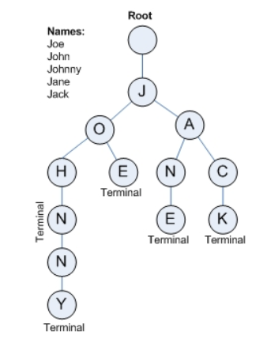

字典树（Trie）用于判断字符串是否存在或者是否具有某种字符串前缀。
是一种哈希树的变种。典型应用是用于统计和排序大量的字符串（但不仅限于字符串），所以经常被搜索引擎系统用于文本词频统计。它的优点是：最大限度地减少无谓的字符串比较。

前缀树的3个基本性质：

- 根节点不包含字符，除根节点外每一个节点都只包含一个字符。
- 从根节点到某一节点，路径上经过的字符连接起来，为该节点对应的字符串。
- 每个节点的所有子节点包含的字符都不相同。

案例：
给你100000个长度不超过10的单词。对于每一个单词，我们要判断他出没出现过，如果出现了，求第一次出现在第几个位置。

即使我们使用哈希，在其中搜索一个单词的实际开销也是非常大的，且无法轻易支持搜索单词前缀。然而由于一个英文单词的长度 n 通常在 10 以内，如果我们使用字典树，则可以在 O(n)——近似 O(1)的时间内完成搜索，且额外开销非常小。
